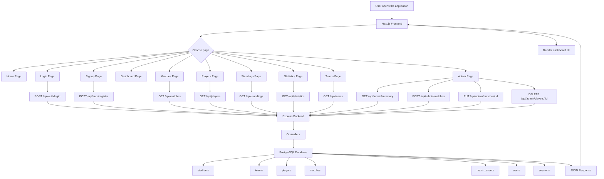

# Premier League Platform Flowchart

```mermaid
flowchart TD
    A[User opens the application] --> B[Next.js Frontend]

    B --> C{Choose page}

    C --> D[Home Page]
    C --> E[Login Page]
    C --> F[Signup Page]
    C --> G[Dashboard Page]
    C --> H[Matches Page]
    C --> I[Players Page]
    C --> J[Standings Page]
    C --> K[Statistics Page]
    C --> L[Teams Page]
    C --> M[Admin Page]

    E --> N[POST /api/auth/login]
    F --> O[POST /api/auth/register]

    H --> P[GET /api/matches]
    I --> Q[GET /api/players]
    J --> R[GET /api/standings]
    K --> S[GET /api/statistics]
    L --> T[GET /api/teams]

    M --> U[GET /api/admin/summary]
    M --> V[POST /api/admin/matches]
    M --> W[PUT /api/admin/matches/:id]
    M --> X[DELETE /api/admin/players/:id]

    N --> Y[Express Backend]
    O --> Y
    P --> Y
    Q --> Y
    R --> Y
    S --> Y
    T --> Y
    U --> Y
    V --> Y
    W --> Y
    X --> Y

    Y --> Z[Controllers]
    Z --> AA[PostgreSQL Database]

    AA --> AB[stadiums]
    AA --> AC[teams]
    AA --> AD[players]
    AA --> AE[matches]
    AA --> AF[match_events]
    AA --> AG[users]
    AA --> AH[sessions]

    AA --> AI[JSON Response]
    AI --> B
    B --> AJ[Render dashboard UI]
```
